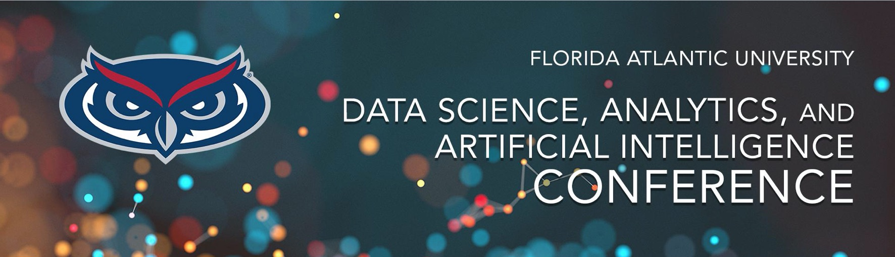
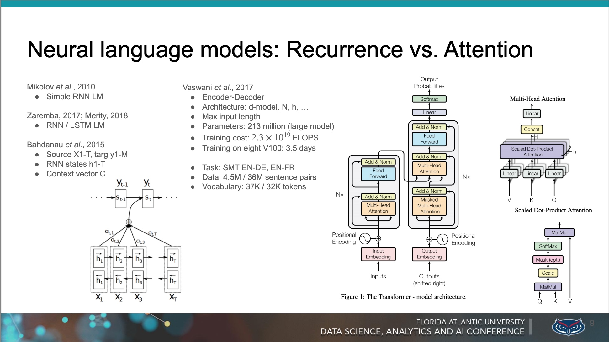

# README 

## Data Science, Analytics, and AI Conference, Florida Atlantic University

 

[https://www.fau.edu/data/schedule/2020/](https://www.fau.edu/data/schedule/2020/)  
Slides from the Florida Atlantic University, Data Science, Analytics, and AI Conference, Saturday, November 14, 2020.

### *Natural Language Processing and AI: Neural and Symbolic Approaches* 

**Speaker: Nelson Correa, *Ph.D.***  
Twitter: [@nelscorrea](https://twitter.com/nelscorrea)  
[https://linkedin.com/in/ncorrea](https://linkedin.com/in/ncorrea)  

### Abstract

New performance of applications in natural language processing (NLP) and artificial intelligence (AI) are driving the current interest in the technologies in business for improved products, services and digital transformation. The new performance is possible by neural network (i.e., connectionist or “deep”) models of learning, together with concrete tasks and evaluation benchmarks with massive datasets. However, the pure connectionist approach with end-to-end training of deep models has shown its limitations in several areas which we discuss in this talk. We illustrate current applications of NLP, introduce feature engineering and the NLP application pipeline, and present neural network models for text classification and language generation, together with their current limitations. Next we trace back to symbolic approaches to NLP and AI of earlier decades, including logic; linguistic models; hierarchical, modular organization of knowledge, perception and cognition; and knowledge graphs. We conclude with recent assessments of progress in the field and work on neuro-symbolic systems. Slides and a notebook with code will be available after the talk.

*KEYWORDS*: NLP, AI, neural networks, symbolic systems, NLP applications

 

------------------

### Slides (PDF)

* [Schedule](https://www.fau.edu/data/schedule/2020/)
* [Abstract](./dsaai-3-paper-14-NLP-AI-Neuro-Symbolic-Correa.pdf) 
* [Slides](./Correa-slides-14-NeuroSymbolic-NLP-AI.pdf)
* [YouTube](https://youtu.be/F8NKV2ZGR_Q)

 

