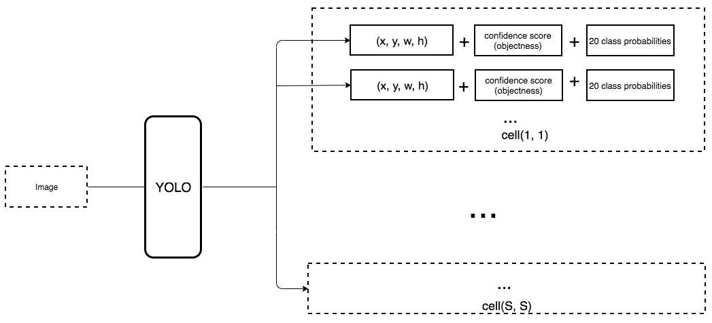

# README
## Palm Beach Data Science Meetup (07/18/2019)

[https://www.meetup.com/Palm-Beach-Data-Meetup/events/262988444/](https://www.meetup.com/Palm-Beach-Data-Meetup/events/262988444/)  
Slides and Jupyter notebooks from the Palm Beach Data Science Meetup of Thursday, July 18, 2019.

 

### *Deep Learning Architectures for Image Classification and Object Detection*

**Speaker: Nelson Correa, *Ph.D.***  
Twitter: [@nelscorrea](https://twitter.com/nelscorrea)  
[https://linkedin.com/in/ncorrea](https://linkedin.com/in/ncorrea)  

<!-- img src="./images/pbds_meetup_cv_20190718.jpg" alt="Palm Beach Data Science Meetup" width="700" -->

### Description

Object detection is a task in computer vision with many practical applications that can now be achieved with super-human levels of performance on selected benchmarks using deep neural networks.
In this talk we define the *object detection* task and present J. Redmon's [YOLO (You Only Look Once) V3](https://pjreddie.com/yolo/) deep neural network architecture.
As preliminaries to object detection and YOLOv3, we first describe image classification on the Pascal VOC and ImageNet benchmark datasets, and introduce a series of deep learning neural network architectures that include the multilayer perceptron (MLP), convolutional neural networks (CNNs), and other networks with dystopian names such as AlexNet, GoogLeNet/Inception, VGG16, ResNet, and Region-CNN (R-CNN). 
We conclude with note of recent developments, including *capsule networks* (CapNets) by G. Hinton and deep networks with visual feedback.
Slides and notebooks with code will be available after the talk.

------------------

### Slides (HTML)

* [PBDS Main Slide deck](./PBDS_DeepLearningCV_2019.slides.html)
* [MNIST Digit Classification (MLP and CNN)](./MNIST_Digit_Classification.html)
* [VGG16 Image Classification](./VGG16_Image_Classification.html)
* [YOLOv3 Object Detection](./YOLOv3_Object_Detection.html)

------------------

### Jupyter Notebooks

* [MNIST Digit Classification (MLP and CNN)](https://github.com/nelscorrea/PBDS_Meetup_2019/blob/master/MNIST_Digit_Classification.ipynb)
* [VGG16 Image Classification](https://github.com/nelscorrea/PBDS_Meetup_2019/blob/master/VGG16_Image_Classification.ipynb)
* [YOLOv3 Object Detection](https://github.com/nelscorrea/PBDS_Meetup_2019/blob/master/YOLOv3_Object_Detection.ipynb)

------------------

### Required files

#### `VGG16_Image_Classification.ipynb`
To train the custom output classifier of `VGG16_Image_Classification.ipynb`, a subset of the Kaggle dogs vs. cats data is needed, and the variable `kaggle_dogcats_dir` needs to be set to your local directory with the data (e.g.,  `'/your_datasets/dogs-vs-cats/'`). Your may download the data from:
* dogs vs. cats data: https://kaggle.com/c/dogs-vs-cats/data

The image data directory should have `test`, `train` and `validation` subdirectories, each with `cats` and `dogs` subdirectories.

#### `YOLOv3_Object_Detection.ipynb`
To run the `YOLOv3_Object_Detection.ipynb` notebook you must download the pre-trained `yolov3.weights` file from J. Redmon's site to a local directory on your machine, and change the variable `weights_path` in the second code cell of the notebook to your local directory.

Steps:
* Download `yolov3.weights` from https://pjreddie.com/media/files/yolov3.weights.
* `weights_path = '/Your_Local_Directory_Models/yolov3.weights'`

------------------

