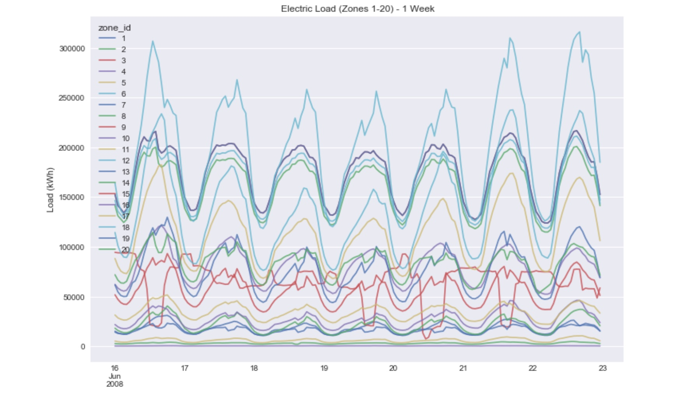

# PyData Miami 2019
[https://pydata.org/miami2019/](https://pydata.org/miami2019/)

01/10/2019

**Title**: Weather and Electric Load Forecasting with Python Data Science Tools

**Speaker**: Nelson Correa, *Ph.D.*  
[@nelscorrea](https://twitter.com/nelscorrea)

**Abstract**: 

This talk presents weather and electric load forecasting using Python data science and machine learning tools (NumPy, Pandas, Scikit-learn). Using weather data from NOAA for the U.S., Florida, and Miami, we  build a data pipeline for data exploration, summarization, visualization, feature engineering, regression and classification, and finally scoring and evaluation of predictive models.

 

------------------

### Slides (PDF)

* [Conference Program](https://pydata.org/miami2019/schedule/)
* [Abstract](https://pydata.org/miami2019/schedule/presentation/9/) 
* [Slides-1, Weather](./PyDataMiami2019_WeatherForecasting-slides.pdf)
* [Slides-2, Electric load](./PyDataMiami2019_ElectricLoadForecasting-slides.pdf)

 

