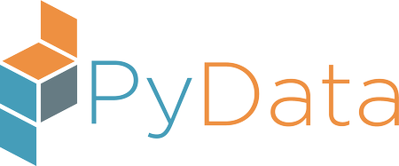
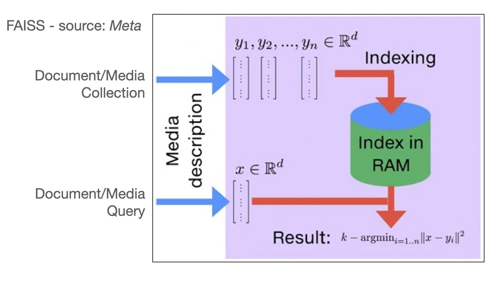

# PyData Miami 2022
[https://pydata.org/miami2022/](https://pydata.org/miami2022/)

09/22/2022

 

**Title**: *Enterprise Semantic Search with Python Large Language Models*

**Speaker**: Nelson Correa, *Ph.D.*  
Twitter: [@nelscorrea](https://twitter.com/nelscorrea) 
Linkedin: [https://linkedin.com/in/ncorrea](https://linkedin.com/in/ncorrea)

**Abstract**: 

Enterprise Search is a key use case in big data and business computing. In this talk we introduce Enterprise Semantic Search with Large Language Models (LLMs), and present a working demonstration in the financial domain. Semantic search is search based on meaning representations, instead of literal document and query keywords. We use the recent HuggingFace transformers library, together with related Python libraries (TensorFlow, sklearn and UMAP) for NLP and deep learning. Approaches, data visualization, metrics and datasets for search system evaluation are introduced. The talk will be of interest to developers working on text search and new unstructured data applications. Slides and a demo notebook will be available at the time of PyData Miami 2022.

 

------------------

### Jupyter notebook

* https://github.com/nelscorrea/PyDataMiami2022/

### Materials

* [Conference Program](https://pydata.org/miami2022/schedule/)
* [Abstract](https://miami2022.pydata.org/cfp/talk/RQD3Y8/) 
* [Slides](./PyData_Miami_2022_ESS_ncorrea_FINAL.pdf) (PDF)
<!-- * [Repository - TBD](./) -->

 

