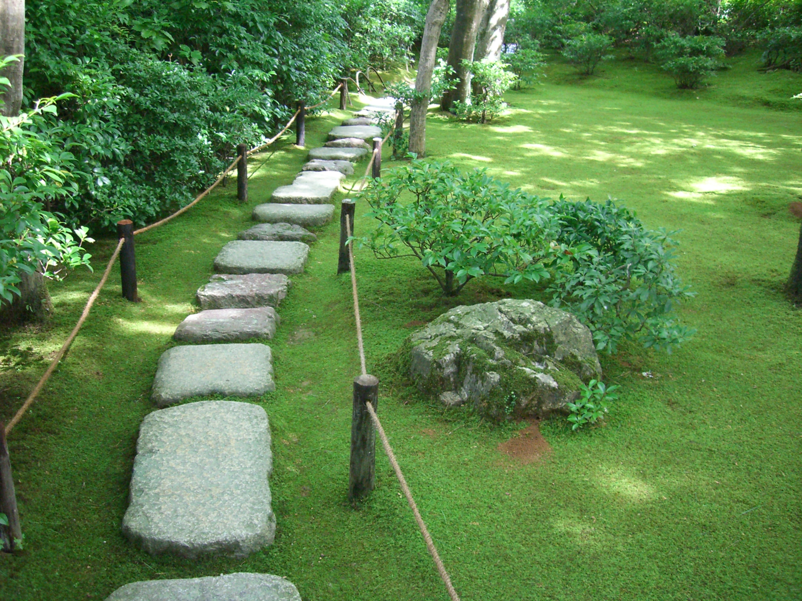

# nelscorrea.github.io

 
## *Nelson Correa* 
Data scientist and machine learning developer.  
AI, Deep learning, natural language processing, machine translation, and speech recognition.  
Twitter: [@nelscorrea](https://twitter.com/nelscorrea)  
LinkedIn: [https://linkedin.com/in/ncorrea](https://linkedin.com/in/ncorrea)  

 
### Talk repositories
*  [Palm Beach Data Science Meetup](https://github.com/nelscorrea/PBDS_Meetup_2019) - [Slides](./PBDS_Meetup_2019) (07/18/2019)

 

