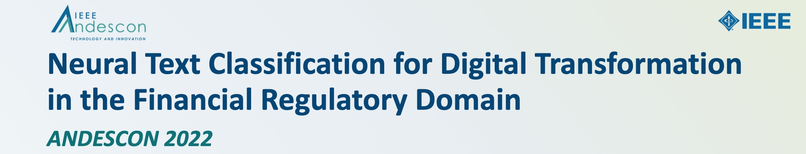
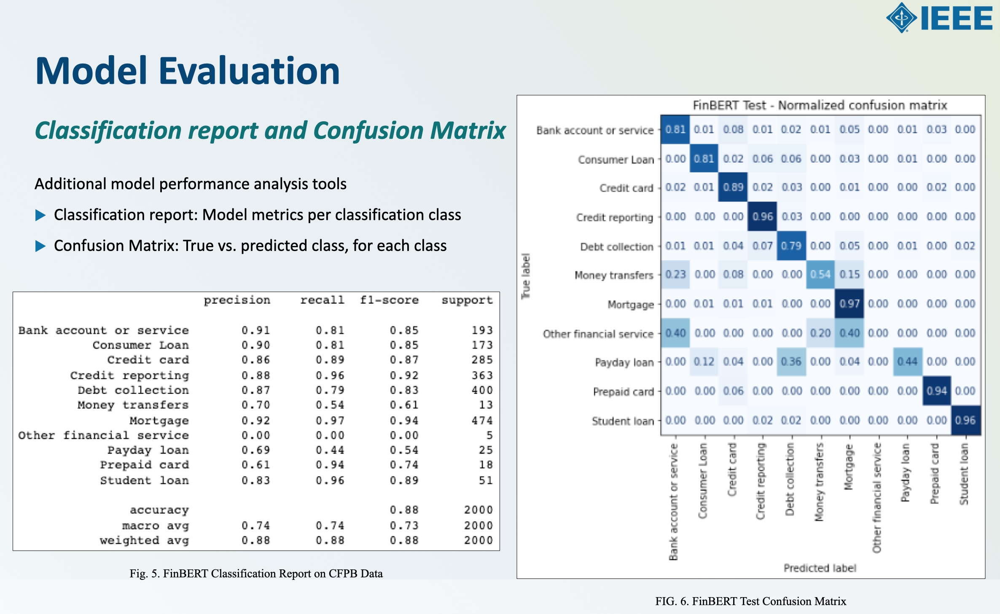

# 2022 IEEE Andescon 

[https://attend.ieee.org/andescon/](https://attend.ieee.org/andescon/)

11/16-19/2022

 

**Title**: *Neural Text Classification for Digital Transformation in the Financial Regulatory Domain*

**Authors**: Nelson Correa, *Ph.D.*; Antonio Correa, *MBA*  
Twitter: [@nelscorrea](https://twitter.com/nelscorrea) 
Linkedin: [https://linkedin.com/in/ncorrea](https://linkedin.com/in/ncorrea)

**Abstract**: 

A core use case in artificial intelligence and natural language processing (NLP) is automatic text classification of documents, for the efficient, transparent and reliable handling of the billions of documents generated each year as part of business and government operation. Our application for document analysis uses deep learning for Neural Text Classification, with recurrent (Bi-LSTM) and transformer neural networks (DistilBERT and FinBERT). We compare the new models against traditional TF-IDF bag-of- words machine learning models, and evaluate text classification on a corpus of over 2,600,000 consumer financial complaints from the U.S. Consumer Financial Protection Bureau (CFPB), an agency of the U.S. Federal government created as a result of the 2008 financial crisis. Our analysis shows the superiority of the transformer models, with a classification accuracy of 88.05% on the task formulated.

 

 

------------------

### Jupyter notebook

* [https://github.com/nelscorrea/andescon2022/](https://github.com/nelscorrea/andescon2022/)

### Materials

* [Conference Program](https://ieeexplore.ieee.org/xpl/conhome/9989530/proceeding/)
* [Paper](./ANDESCON2022_neural_nlp_2350_ncorrea_paper.pdf) (PDF)
* [Slides](./ANDESCON2022_neural_nlp_2350_ncorrea_slides_sm.pdf) (PDF)
<!-- * [Repository - TBD](./) -->

 

