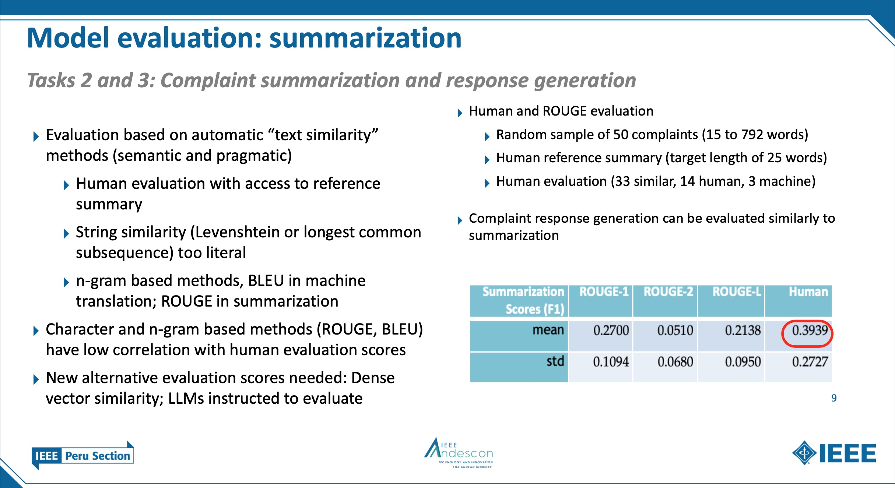

# 2024 IEEE Andescon 

[https://attend.ieee.org/andescon/](https://attend.ieee.org/andescon/)

September 11 - 13, 2024

 

**Title**: *Generative AI for Consumer Communications: Classification, Summarization, Response Generation*

**Authors**: Nelson Correa *, *Ph.D.*; Antonio Correa, *MBA*; Wlodek Zadrozny, *Ph.D.*  
\* Twitter: [@nelscorrea](https://twitter.com/nelscorrea) 
\* Linkedin: [https://linkedin.com/in/ncorrea](https://linkedin.com/in/ncorrea)

**Abstract**: 

Generative AI showed the unexpected power of large language models (LLMs) for understanding and generation of natural language text and other modalities at the end of 2022. This paper presents a novel generative AI system for text classification, summarization and response generation of consumer communications. The system uses the same foundation model and a uniform pipeline for the tasks proposed. Consumer communications are massive and served mainly via voice and text, and until recently could be handled only with human agents (customer service representatives). However, they must be handled with quality, consistency, speed and low cost, at scale. We limit our attention to financial consumer communications from the U.S. Consumer Financial Protection Bureau (CFPB), publicly available in a dataset of over 4.7 million complaints. Performance reaches 88% accuracy (without fine-tuning) for classification and over 72% for summarization and response generation. Artificial intelligence has great positive impacts for business and society, but its application and deployment also poses risks and unknowns. We thus address the important questions of risk, bias, interpretability, explainability, safety and regulatory compliance with the emerging legal frameworks.

 

 

------------------

<!--
### Jupyter notebooks

* [https://github.com/nelscorrea/andescon2024/](https://github.com/nelscorrea/andescon2024/)
-->

### Materials

* [Conference Program](https://attend.ieee.org/andescon/)
* [Paper](./ANDESCON2024_genai_ncorrea_paper_43.pdf) (PDF)
* [Slides](./ANDESCON2024_Paper43_NCorrea_TALK_20240913_sm.pdf) (PDF)
<!-- * [Repository - TBD](./) -->

 

