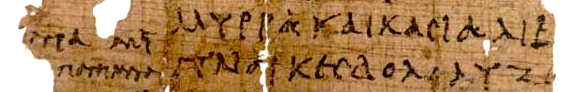

# Nelson Correa - Publications

 

## List of Publications

* List of publications ([PDF](./CV-NCorrea-2022-pubs.pdf))
* [Google Scholar](https://scholar.google.com/citations?user=WxKuWs8AAAAJ)

 

## Ph.D. Dissertation

“*Syntactic Analysis of English with respect to Government-Binding Grammar*,” Syracuse University,    
Department of Electrical and Computer Engineering, 1988, 
UMI ProQuest 8914562 ([PDF](https://nelscorrea.github.io/pubs/NLP-1988-Correa-PhD_Dissertation_ProQuest_1595339639202.pdf))

 

## Selected Publications

* “*Attribute and Unification Grammar:  A review and analysis of formalisms*.”  Annals of Mathematics and Artificial Intelligence, Vol. 8, No. III, J.C. Baltzer, Zürich, 1993.  ([PDF](./NLP-1993-Correa1993_Article_AttributeAndUnificationGrammar.pdf))

* “*Conceptual Structure and its Relation to the Structure of Lexical Entries.”  With J. Kornfilt.  Knowledge and Language, Vol.2: Lexical and Conceptual Structure; E. Reuland and W. Abraham, eds.  Kluwer Academic Publishers, Dordrecht, Netherlands, 1993.  ([PDF](./NLP-1993-Kornfilt_Correa_LexicalConceptualStructure-Kluwer.pdf))

* “*Empty Categories, Chain Binding, and Parsing*.”  in Principle-based Parsing: Computation and Psycholinguistics, R. C. Berwick, C. Tenny, and S. Abney, eds.  Kluwer Academic Publishing, Dordrecht, Netherlands, 1991.  Also M.I.T. Center for Cognitive Science, Working Papers of the Center for Cognitive Science, and I.B.M. Research Report RC14336, Yorktown Heights, New York.  ([PDF](./NLP-1992-Correa_EmptyCategoriesChainBindingParsing-Springer.pdf))

 

